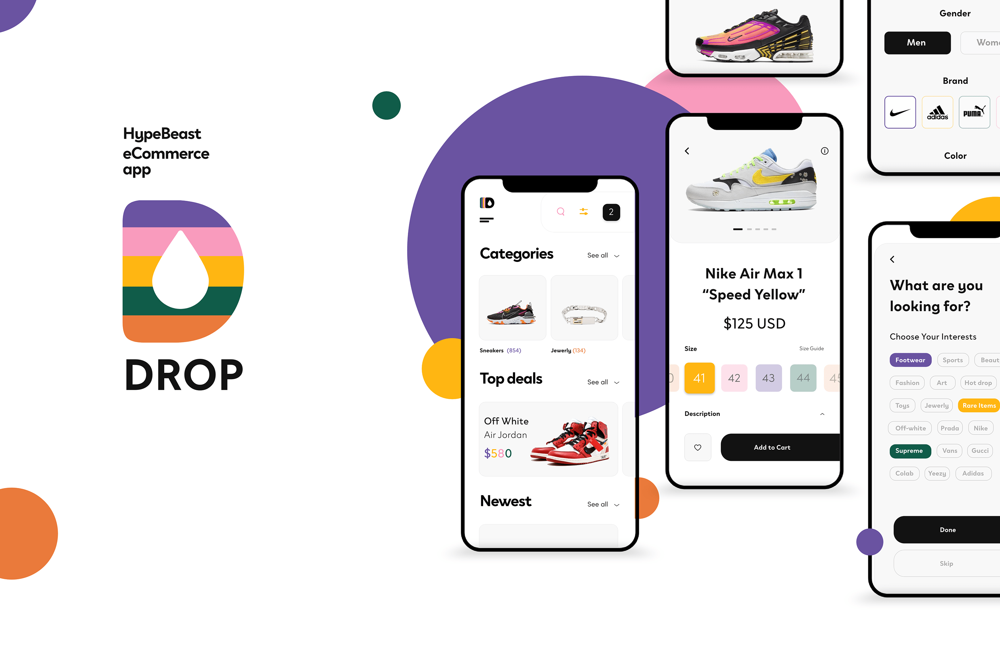
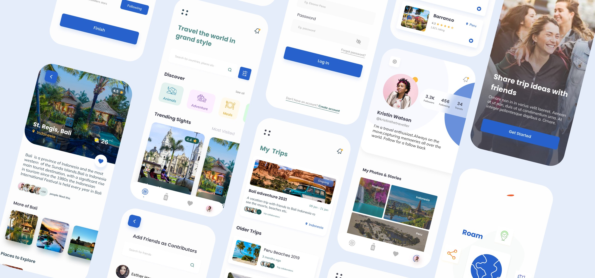

<h1 align="center">
 Flutter Catalog 
</h1>

    Flutter Catalog is a  very handy catalog of beautifully designed widgets to help ease your <strong>flutter </strong> journey.

    It is inspired by a lot of UI Kits. I will be updating the list as I build them.

<a href="https://www.behance.net/gallery/72907227/Social-Meet-Up-UI-Kit-FREE-for-Adobe-XD?tracking_source=search_projects_recommended%7Cfree%20ui%20kit" target="_blank">Social MeetUp Design</a>

 
    

# Cases Studies
 

# Drop Case Study

<a href="https://www.behance.net/gallery/102261423/DROP-Online-Store-E-commerce?tracking_source=curated_galleries_ui-ux" target="_blank">Drop Design on Behance</a>

<a href="https://github.com/david-legend/drop" target="_blank">GitHub Link to the stand alone project</a>

 

# Roam Case Study

<a href="https://www.figma.com/proto/KF7dQnZJSrgk0E5UnE1sad/Roam?node-id=247%3A60&viewport=352%2C-1453%2C0.18740859627723694&scaling=scale-down" target="_blank">Roam Prototypes in Figma</a>

<a href="https://github.com/david-legend/roam" target="_blank">GitHub Link to the stand alone project</a>

 

# Activities & Profile Designs

# Onboarding Designs

# Menus

# Dialogs and BottomSheets

# Stats & Info Designs

